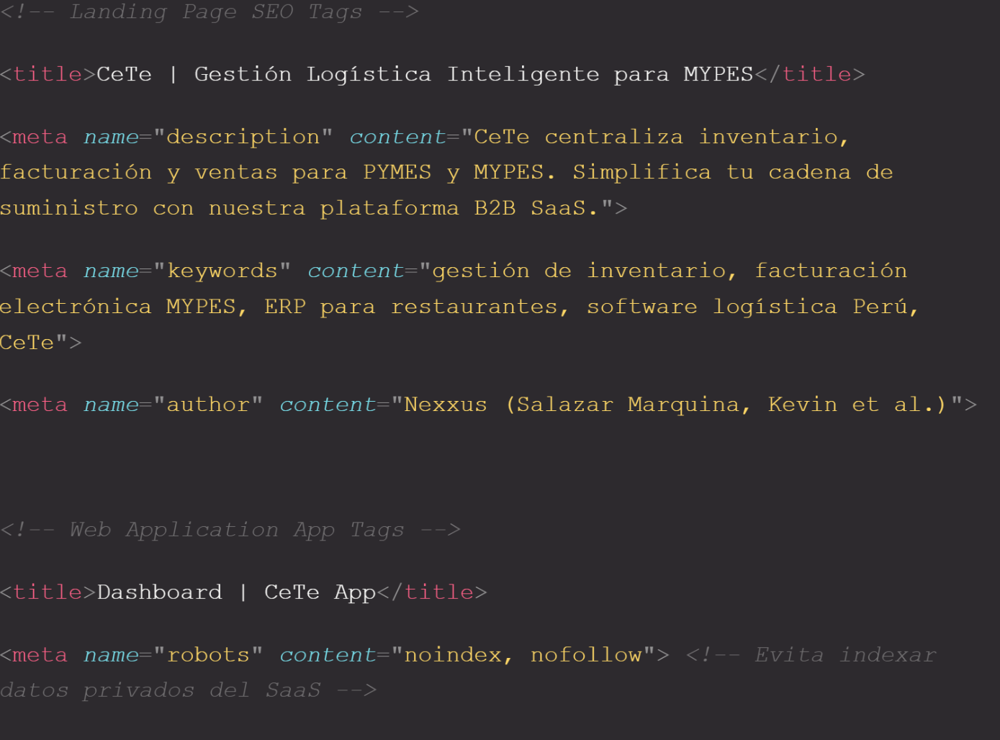

UNIVERSIDAD PERUANA DE CIENCIAS APLICADAS

CURSO: Aplicaciones Web (8168)

PROFESORES: Bautista Ubillús, Efraín Ricardo / Mori Paiva, Hugo Allan / Sánchez Ponce, Alex Humberto / Sánchez Seña, Alberto Wilmer / Velásquez Núñez, Ángel Augusto / Villafuerte Bazán, Óscar Iván

INFORME DE TRABAJO FINAL: Aplicaciones Web

Startup: NEXXUS

Producto: CeTe

Integrantes:

U202421123 - Anahua Ancachi, Liz Maribel

U202414313 - Campoblanco Guzman, Diego Roberto

U202XXXXXX - [Apellido], Piero (Por completar)

U202417747 - Salazar Marquina, Kevin Junior

U202422620 - Salazar Quiche, Darikson Bill

Lima, Septiembre de 2026

Registro de Versiones del Informe

Versión

Fecha

Autor

Descripción de modificación

1.0

06/09/2026

Equipo Nexxus

Creación del documento base, Integración de Capítulos I y II, estructuración bajo requerimientos de Aplicaciones Web.

Project Report Collaboration Insights

El desarrollo y evolución de este informe de proyecto se gestiona de forma colaborativa a través de un repositorio de control de versiones en GitHub, perteneciente a la organización pública de nuestro equipo (Nexxus). El siguiente enlace lleva al URL del repositorio que se encuentra en nuestra organización pública: https://github.com/Nexxus-ops/CeTe-Report

Durante esta primera etapa (AV1), todos los miembros del equipo han colaborado en la redacción de los capítulos iniciales utilizando la sintaxis Markdown, aplicando flujos de trabajo basados en branches (ramas) para la redacción de cada sección y realizando Pull Requests para su revisión antes de la integración a la rama principal (main).

Para la entrega de la TB1, este es el análisis de colaboración que presenta el número de contribuciones hechas en el repositorio del informe.

(Pendiente: Insertar capturas de los analíticos de colaboración y gráficas de commits en Github de los miembros del equipo).

Contenido

Student Outcome

Capítulo I: Introducción

1.1. Startup Profile

1.2. Solution Profile

1.3. Segmentos objetivo

Student Outcome

El curso contribuye al cumplimiento del Student Outcome ABET:

ABET – EAC - Student Outcome 5

Criterio: La capacidad de funcionar efectivamente en un equipo cuyos miembros juntos proporcionan liderazgo, crean un entorno de colaboración e inclusivo, establecen objetivos, planifican tareas y cumplen objetivos.

En el siguiente cuadro se describe las acciones realizadas y enunciados de conclusiones por parte del grupo, que permiten sustentar el haber alcanzado el logro del ABET – EAC - Student Outcome 5.

Criterio Específico

Acciones Realizadas

Conclusiones

Trabaja en equipo para proporcionar liderazgo en forma conjunta

Salazar Marquina, Kevin Junior

AV1: Asumió el liderazgo en la redacción del modelo de negocio, estructurando los antecedentes basados en las experiencias del equipo en consorcios de alimentos.

[Apellido], Piero

AV1: Lideró la organización de las entrevistas orientadas al segmento de dueños de restaurantes.

Campoblanco Guzman, Diego Roberto

AV1: Moderó las sesiones de EventStorming y mapeo de procesos logísticos.

Anahua Ancachi, Liz Maribel

AV1: Lideró la definición de los User Personas y el diseño inicial (UI) basado en el rubro comercial.

Salazar Quiche, Darikson Bill

AV1: Encargado de la configuración inicial de los repositorios GitFlow.

(Pendiente: Redactar de forma grupal las conclusiones sobre cómo el liderazgo compartido ha mejorado la toma de decisiones técnicas y de negocio en el equipo durante la fase de planeación).

Capítulo I: Introducción

1.1. Startup Profile

1.1.1. Descripción de la Startup

Nuestra startup nace de la experiencia directa de sus fundadores lidiando con ineficiencias operativas en diferentes rubros comerciales. Habiendo trabajado desde el interior de negocios familiares de gastronomía, almacenes corporativos, empresas textiles recientes y consorcios de distribución de alimentos para el Estado, el equipo identificó un "dolor" compartido: la ausencia crítica de herramientas tecnológicas adaptadas a la realidad de las Micro y Pequeñas Empresas (MYPES).

Tradicionalmente, este sector gestiona su cadena de suministro mediante métodos empíricos (cuadernos, apuntes a mano) o archivos de Excel aislados, lo que desencadena en pérdida de tiempo, extravío de mercadería y falta de trazabilidad. Frente a esto, nuestra startup, Nexxus, se dedica a desarrollar soluciones de software B2B (Business-to-Business) ágiles y generalizables que democraticen la digitalización. Nuestro producto estrella, CeTe (Celer Tech), es el reflejo de esta visión.

Misión: Democratizar el acceso a la tecnología para las MYPES latinoamericanas, proporcionando herramientas digitales intuitivas y centralizadas que optimicen su cadena de suministro y les permitan competir con mayor eficiencia en el mercado.

Visión: Convertirnos en el aliado tecnológico líder (el "sistema nervioso central") de la logística y operaciones para pequeñas y medianas empresas, escalando nuestras plataformas hacia la integración con tecnologías avanzadas como el Internet de las Cosas (IoT).

Valores:

Empatía: Entendemos los problemas de nuestros usuarios porque los hemos vivido en carne propia.

Innovación adaptable: Creamos soluciones que se amoldan a la realidad y tamaño de cada negocio, no al revés.

Transparencia: Promovemos la claridad de la información tanto en el interior de nuestra startup como en las operaciones de nuestros clientes.

Eficiencia: Buscamos hacer más con menos, eliminando los procesos repetitivos y manuales.

1.1.2. Perfiles de integrantes del equipo

[Placeholder: Fotos del equipo]

Anahua Ancachi, Liz Maribel

Código: U202420071

Carrera: Ingeniería de Software

Perfil: Estudiante con sólidos conocimientos en el desarrollo frontend y backend. Aporta al equipo habilidades en la implementación de arquitecturas orientadas a dominio (DDD).

Campoblanco Guzman, Diego Roberto

Código: U202414313

Carrera: Ingeniería de Software

Perfil: Actualmente estudio la carrera de Ingeniería de Software en la UPC. Soy una persona apasionada por la programación, enfocada en la creación de aplicaciones modulares y en la simulación de infraestructuras de red y dispositivos IoT. Busco garantizar que la integración del hardware se comunique de manera eficiente con las bases de datos y la plataforma web.

[Apellido], Piero

Código: U202411324

Carrera: Ingeniería de Software

Perfil: [escriban algo pue].

Salazar Marquina, Kevin Junior

Código: U202417747

Carrera: Ingeniería de Software

Perfil: Estudiante con sólidos conocimientos en el desarrollo frontend y backend. Aporta al equipo habilidades en el uso de frameworks como Angular y Spring Boot, enfocado en asegurar la escalabilidad del sistema B2B.

Salazar Quiche, Darikson Bill

Código: U202422620

Carrera: Ingeniería de Software

Perfil: [escriban algo pue].

1.2. Solution Profile

1.2.1 Antecedentes y problemática

Históricamente, las Micro y Pequeñas Empresas (MYPES) han administrado su logística mediante procesos rudimentarios, apoyándose en registros manuales o herramientas ofimáticas básicas sin integración. Esta falta de digitalización genera cuellos de botella críticos, tales como la pérdida de trazabilidad en los suministros, desajustes imprevistos en el stock y una visibilidad limitada sobre la rentabilidad real de sus transacciones comerciales.

En el panorama tecnológico actual, las alternativas de software robustas suelen ser inaccesibles para los pequeños empresarios, ya sea por sus elevadas tarifas de licenciamiento o por la complejidad técnica que exige su configuración. Se evidencia, así, una desconexión entre la urgencia de modernización de este sector y la oferta de mercado, que frecuentemente ignora las limitaciones financieras y la agilidad operativa propias de las MYPES.

Con el propósito de profundizar en la naturaleza del problema identificado, hemos empleado la metodología de análisis The 5 'W's y 2 'H's:

Who (¿Quién lo sufre?): Propietarios, gestores administrativos y colaboradores operativos de MYPES que carecen de ecosistemas tecnológicos estandarizados para sus procesos.

What (¿Cuál es el problema?): Inexistencia de un entorno digital unificado para articular el inventario, las ventas y el despacho, resultando en una gestión basada en la empirismo o registros aislados.

Where (¿Dónde ocurre?): En el núcleo de las actividades empresariales diarias, particularmente dentro de los almacenes, centros de distribución y puntos críticos de venta.

When (¿Cuándo ocurre?): Se manifiesta durante el control de flujos de mercadería, en la conciliación de existencias y al intentar rastrear la trazabilidad de cada transacción comercial.

Why (¿Por qué ocurre?): Debido a que las soluciones ERP del mercado actual suelen ser financieramente prohibitivas, técnicamente complejas y poco flexibles ante la agilidad que requiere una pequeña empresa.

How (¿Cómo se manifiesta?): Mediante ineficiencias operativas, pérdida de trazabilidad de suministros, descuadres de stock imprevistos y una visibilidad limitada sobre la salud financiera real.

How Much (¿Cuánto afecta?): Provoca mermas económicas por falta de control, vencimientos no gestionados y un elevado costo de oportunidad por la excesiva carga de tareas manuales.

Objetivo del producto:
Con el objetivo de cerrar esta brecha, surge CeTe como un ecosistema digital bajo la modalidad SaaS, enfocado en unificar y potenciar la cadena de valor. Nuestra herramienta permite articular los flujos de almacén, transacciones de venta y logística de entrega en un solo entorno, facilitando reportes financieros automáticos y notificaciones preventivas mediante una experiencia de usuario simplificada y adaptable.

1.2.2 Lean UX Process

1.2.2.1. Lean UX Problem Statements

Aplicando la estructura sugerida por el marco de trabajo Lean UX (Brand new initiative), definimos el problema transversal para todos nuestros segmentos objetivo:

The current state of the supply chain and warehouse management in diverse MSEs (restaurants, textile, food consortiums) has focused mainly on rudimentary manual methods like physical notebooks or isolated Excel sheets to record what is bought, what is delivered, and the quantities.

What existing products/services fail to address is the need for an adaptable, generalized, and intuitive web template system that eliminates manual counting without requiring complex and expensive ERP setups.

Our product/service will address this gap by offering "CeTe", an agile SaaS platform that acts as the central nervous system for businesses, unifying warehouse management, sales, and dispatch in one place.

Our initial focus will be business owners and logistics managers in sectors suffering from manual chaos.

We'll know we are successful when we see a daily adoption of the system replacing notebooks, a significant reduction in time spent searching for or counting merchandise, and clear visibility of goods' destinations.

1.2.2.2. Lean UX Assumptions

En base a la discusión del equipo, planteamos nuestras creencias fundamentales:

Business Assumptions:

Creemos que las MYPES necesitan urgentemente reemplazar los cuadernos y excels por una plataforma web centralizada.

Creemos que los dueños de negocios estarán dispuestos a pagar una suscripción SaaS accesible para dejar de perder mercadería y tiempo.

Business Outcome Assumptions:

Lograremos captar una base inicial sólida de suscripciones aprovechando la adaptabilidad de CeTe a múltiples rubros (Textil, Alimentos, Restaurantes).

El nivel de retención será alto porque una vez digitalizado el inventario, volver al cuaderno no es una opción viable.

User Assumptions:

Nuestros usuarios operativos (almaceneros, encargados) saben usar tecnología cotidiana pero necesitan sistemas con cero fricción, casi tan fáciles como usar una red social.

Los dueños de negocios sienten estrés por la falta de transparencia (no saber "a dónde se fue lo que compró").

User Outcome and Benefit Assumptions:

Los operarios ahorrarán horas a la semana al no tener que buscar productos físicamente a ciegas o contar manualmente.

Los dueños tendrán la tranquilidad de saber exactamente su estado logístico y financiero en tiempo real.

Feature Assumptions:

Creemos que un módulo ágil de ingresos y salidas reducirá los errores de tipeo o escritura manual.

Creemos que un panel de control (Dashboard) generalizable permitirá a cualquier rubro ver sus métricas vitales fácilmente.

1.2.2.3. Lean UX Hypothesis Statements

Para validar nuestros Feature Assumptions, planteamos las siguientes hipótesis:

Hypothesis 1:

We believe we will achieve a massive reduction in time lost searching and counting inventory

If warehouse and logistics staff

Attain the ability to record entries and dispatches digitally in seconds, abandoning notebooks

With a centralized, highly intuitive inbound/outbound module.

Hypothesis 2:

We believe we will achieve high trust and subscription retention from business owners

If SME owners and managers

Attain the peace of mind of knowing exactly where their merchandise is and if they are making a profit

With a real-time dashboard acting as the central nervous system of their business.

1.2.2.4. Lean UX Canvas

1. Business Problem (Problema de Negocio)

¿Qué problema tiene el negocio?

Las MYPES (restaurantes, textiles, consorcios) sufren pérdidas económicas y de tiempo porque gestionan su logística y almacén con métodos manuales (cuadernos, Excel aislados).

Los ERPs actuales son muy costosos, complejos y las MYPES no pueden adoptarlos.

2. Business Outcomes (Resultados de Negocio)

¿Qué cambios en el comportamiento del cliente indicarán que hemos resuelto el problema?

Reducción del 50% del tiempo semanal que las MYPES gastan cuadrando inventario.

Adopción diaria del sistema por parte del personal operativo (abandono total del papel).

Lograr 30 suscripciones SaaS activas en los primeros 6 meses.

3. Users / Customers (Usuarios y Clientes)

¿A quiénes estamos resolviendo el problema?

Segmento 1 (El Comprador): Dueños y Administradores de negocio (Restaurantes, Textiles, Consorcios) que buscan control y rentabilidad.

Segmento 2 (El Usuario): Operarios de almacén y Jefes de Logística que manejan el inventario físico diario.

4. User Outcomes & Benefits (Beneficios del Usuario)

¿Qué quieren lograr los usuarios? ¿Cuál es su beneficio?

Dueños: Quieren tranquilidad mental y saber el estado financiero y logístico de su negocio en tiempo real, desde cualquier lugar, sin sufrir estrés por descuadres.

Operarios: Quieren ahorrar horas de trabajo repetitivo, evitar perder el tiempo buscando productos físicamente y terminar su jornada a la hora indicada.

5. Solutions (Soluciones / Ideas)

¿Qué podemos construir para solucionar los problemas?

CeTe SaaS: Una plataforma web que funciona como una "plantilla" logística adaptable.

Un Módulo de Ingresos/Salidas ultra intuitivo (cero fricción) para celular/PC en el almacén.

Un Dashboard Gerencial en tiempo real con alertas de stock mínimo.

Sistema de Roles y Permisos para proteger la información (Vendedor, Almacenero, Admin).

6. Hypotheses (Hipótesis)

¿Cómo combinamos lo anterior en afirmaciones para validar?

Creemos que los dueños confiarán más en su negocio si obtienen un Dashboard en tiempo real mediante CeTe.

Creemos que los operarios ahorrarán horas de trabajo si logran registrar ingresos/salidas en segundos mediante nuestro módulo ágil, abandonando los cuadernos.

7. What's the most important thing we need to learn first? (Supuesto más riesgoso)

¿Cuál es la hipótesis más importante que debemos probar primero?

¿Estarán los operarios de almacén (acostumbrados al papel durante años) dispuestos a usar un sistema web en su día a día sin frustrarse?

¿Están los dueños de las MYPES dispuestos a pagar una suscripción mensual por ordenar su logística?

8. What's the least amount of work we need to do to learn the next most important thing? (MVP / Experimentos)

¿Cuál es el mínimo esfuerzo para probar nuestro supuesto más riesgoso?

Crear un Landing Page con los planes de pago para medir la intención de compra (conversión).

Desarrollar un Prototipo interactivo (Figma) del módulo de ingreso rápido de mercadería y testearlo directamente con operarios de almacén para ver si les parece más fácil que usar un cuaderno.

(Pendiente: Insertar diagrama visual del Lean UX Canvas exportado como imagen)

1.3. Segmentos objetivo

Para el desarrollo de CeTe bajo el modelo B2B SaaS, nos enfocaremos en dos segmentos de usuarios clave, validando que nuestra "plantilla web" cubre tanto las necesidades de control gerencial como la agilidad operativa que requieren rubros como gastronomía, textil y consorcios de alimentos.

1.3.1. Segmento 1: Dueños y Administradores de Negocio (El Comprador)

Representan al sector gerencial y administrativo de la MYPE (los fundadores de la marca textil, los dueños de la cadena de restaurantes, los gerentes del consorcio). Son los tomadores de decisiones que adquieren el software buscando rentabilidad y orden. Su principal dolor es la incertidumbre de no saber con exactitud dónde está su mercadería, si realmente se compró lo que se debía, y el estrés de depender de cuadernos informales para conocer el estado de su empresa.

Características demográficas: Hombres y mujeres entre 30 y 55 años de edad. Residentes en zonas urbanas. Emprendedores y empresarios de nivel socioeconómico B y C.

Nivel de digitalización: Medio. Utilizan smartphones constantemente para comunicarse y vender (redes, WhatsApp), pero para la gestión interna siguen dependiendo de que sus empleados les pasen reportes físicos o archivos básicos.

Información estadística de sustento: Según el Ministerio de la Producción y el INEI (2024), las micro y pequeñas empresas representan el 99.5% del tejido empresarial peruano. Sin embargo, el Sondeo de Adopción Digital de Movistar Empresas señala que la mayoría aún gestiona su logística de forma tradicional. El mismo sondeo demuestra que el 27% de las MIPYMES que logran adoptar herramientas digitales orientadas a la gestión y automatización aumentan inmediatamente sus ventas y reducen mermas.

1.3.2. Segmento 2: Jefes de Logística y Personal Operativo de Almacén (El Usuario Final)

Representan a la fuerza laboral que interactúa diariamente con el inventario, las compras y los despachos. Suelen ser los encargados de los almacenes del consorcio, los jefes de cocina o los operarios textiles. Su principal dolor es la sobrecarga de trabajo manual (apuntar todo en papel), perder tiempo buscando productos que no saben dónde se ubicaron, y la frustración de tener que hacer conteos manuales tediosos a fin de mes.

Características demográficas: Hombres y mujeres jóvenes y adultos jóvenes, de entre 20 y 45 años. Tienen estudios técnicos, secundarios o universitarios en curso.

Nivel de digitalización: Medio (en el ámbito de software empresarial). Son usuarios activos de aplicaciones móviles comerciales, pero en su entorno de trabajo carecen de sistemas ágiles. Requieren herramientas extremadamente intuitivas que faciliten su trabajo, no que lo compliquen.

Información estadística de sustento: La falta de digitalización operativa en sectores de distribución y manufactura genera cuellos de botella severos. La ausencia de un software unificado es la causa principal de horas-hombre desperdiciadas en cuadres de inventario (ComexPerú, 2024), lo que afecta directamente la productividad del personal operativo en las MYPES peruanas.

---

## Capítulo II: Requirements Elicitation & Analysis

### 2.1. Competidores

Para validar nuestra propuesta de valor en el ecosistema B2B SaaS, hemos identificado a tres competidores principales que ofrecen soluciones de digitalización para MYPES en la región.

1.  **Wally POS:** Startup peruana enfocada fuertemente en el punto de venta (POS) y facturación, orientada principalmente a restaurantes y *retail*.
2.  **Alegra:** Plataforma SaaS colombiana enfocada principalmente en la contabilidad y administración financiera para pequeñas empresas, integrando módulos de inventario básicos.
3.  **Odoo:** Un sistema ERP de código abierto con módulos para ventas, almacén y manufactura. Representa a la competencia de software robusto, complejo y de difícil adopción.

#### 2.1.1. Análisis competitivo

| Competitive Analysis Landscape | | | | |
| :--- | :--- | :--- | :--- | :--- |
| **¿Por qué llevar a cabo este análisis?** | Entender el panorama actual para identificar cómo CeTe puede diferenciarse siendo una plataforma más generalizable, amigable y menos restrictiva que un ERP tradicional. | | | |
| *(Logos pendientes)* | **Wally POS** | **Alegra** | **Odoo** | **CeTe (Nexxus)** |
| **Perfil** | | | | |
| Ventaja competitiva | Súper simplificado para el punto de venta (POS) rápido. | Enfoque contable maduro, ideal para contadores. | Altamente modular y robusto (ERP completo). | "Plantilla" adaptable, unificando almacén y logística como sistema nervioso central intuitivo. |
| ¿Qué valor ofrece a los clientes? | Vender rápido en tiendas y cumplir con la SUNAT. | Mantener las finanzas e impuestos en orden. | Tener todas las aplicaciones de gestión interconectadas. | Eliminar los cuadernos y excels, sabiendo exactamente dónde está la mercadería y ahorrando horas. |
| Mercado objetivo | Restaurantes y tiendas minoristas en Perú. | MYPES que priorizan el orden contable. | Desde PYMES hasta grandes corporaciones globales. | Dueños y operarios de MYPES (consorcios, textiles, restaurantes) agobiados por procesos manuales. |
| **Producto** | | | | |
| Productos & Servicios | Punto de venta web, inventario básico, facturación. | Facturación, contabilidad, gestión de inventario. | CRM, eCommerce, Almacén avanzado, Contabilidad. | Gestión de Almacén, Ventas, Despacho, Dashboard en tiempo real y proyección IoT. |
| Precios & Costos | Suscripción mensual por terminal. | Suscripción mensual escalonada. | Costoso por usuario para la versión full en la nube. | Suscripción SaaS mensual/anual accesible. |
| Canales de distribución | Web Application y App móvil POS. | Plataforma Web Cloud. | Plataforma Web, Apps móviles y software de escritorio. | Web Application (Cloud) responsiva (Mobile/Desktop). |
| **SWOT Análisis** | | | | |
| Fortalezas | Excelente usabilidad y presencia local. | Gran ecosistema de integraciones contables. | Código abierto, infinidad de funcionalidades. | Diseño inspirado en dolores reales, alta adaptabilidad (plantilla general). |
| Debilidades | Módulo logístico básico, no apto para distribución compleja. | Enfoque muy administrativo, pesado para el almacenero. | Configuración inicial compleja, requiere consultores. | Startup emergente sin marca establecida aún. |
| Oportunidades | MYPES buscando formalizarse y facturar rápido. | Leyes de facturación electrónica en LATAM. | Empresas en crecimiento que necesitan unificar sistemas. | Alta tasa de negocios que aún usan cuadernos y buscan dar su primer salto digital. |
| Amenazas | Nuevos competidores POS de bajo costo. | Cambios en normativas tributarias. | Soluciones locales de nicho. | Resistencia al cambio del personal acostumbrado al papel. |

#### 2.1.2. Estrategias y tácticas frente a competidores

*   **Frente a Wally:** Resaltaremos la profundidad de nuestro módulo logístico y de despacho, atrayendo a quienes la gestión de almacén de un POS básico ya les quedó corta (ej. Consorcios de alimentos).
*   **Frente a Odoo:** Promoveremos CeTe como un sistema *Plug & Play*, una "plantilla" lista para usar que no requiere semanas de parametrización ni consultores costosos.
*   **Frente a Alegra:** Centraremos nuestra usabilidad en el Operario (el que realmente ingresa los datos). Si el sistema es fácil para el operario (cero fricción), los reportes llegarán solos al dueño, diferenciándonos de los sistemas diseñados solo para contadores.

### 2.2. Entrevistas.

#### 2.2.1. Diseño de entrevistas.

Para recolectar información cualitativa y descubrir competidores reales, hemos diseñado una batería de preguntas para nuestros dos segmentos objetivos.

**Preguntas Generales (Demografía, Tecnología, Marcas):**
1.  *Demografía y Perfil:* ¿Cuál es tu nombre, edad, rol en el negocio y cuánto tiempo llevas trabajando en tu rubro?
2.  *Tecnología:* ¿Qué dispositivo usas más en tu día a día (celular, laptop), y cuáles son tus aplicaciones favoritas?
3.  *Contexto:* Descríbeme brevemente cómo es un día normal de trabajo para ti, desde que llegas hasta que te vas.

**Preguntas de Problema (Core del Negocio):**
1.  *Dolor:* Actualmente, ¿cómo llevas el control de lo que entra, lo que sale y lo que tienes en el almacén? (¿Cuadernos, Excel, memoria?)
2.  *Dolor:* ¿Cuál es el mayor dolor de cabeza o problema que enfrentas al rastrear mercadería o hacer inventarios? ¿Cuánto tiempo pierdes en esto?
3.  *Competencia:* ¿Alguna vez has buscado o intentado usar algún software para solucionar esto? Si es así, ¿cuál fue y por qué funcionó o no?
4.  *Validación:* Si te presentamos una plataforma web (como una plantilla adaptable) fácil de usar que centralice tu almacén, ventas y despacho, ¿estarías dispuesto a probarla?

**Preguntas Específicas por Segmento:**
*   **Para el Segmento 1 (Dueños, Administradores):**
    1.  ¿Te genera desconfianza o estrés no saber a dónde se fue exactamente la mercadería o los insumos que compraste?
    2.  ¿Sientes que hay un descuadre frecuente entre lo que inviertes y lo que rinde el negocio?
*   **Para el Segmento 2 (Jefes de Logística, Operarios):**
    1.  ¿Qué tan frustrante es para ti tener que contar producto por producto o transcribir apuntes de cuadernos a fin de mes?
    2.  Cuando despachan o reparten mercadería, ¿cómo se aseguran de que no haya confusiones y llegue correctamente?

#### 2.2.2. Registro de entrevistas.

Como evidencia de nuestra investigación cualitativa, hemos consolidado las entrevistas de nuestros dos segmentos en un único video editado.

**Video de Evidencia de Entrevistas (Consolidado):**
*   **Enlace Microsoft Stream:** [https://web.microsoftstream.com/video/fake-id-12345-aitodu](https://web.microsoftstream.com/video/fake-id-12345-aitodu)
*   **Duración total:** 24:15 min

**Segmento 1: Tomadores de Decisión (Dueños, Administradores, Gerentes)**

*   **Entrevista 1: Carlos Mendoza**
    *   **Edad / Distrito:** 45 años / Santiago de Surco.
    *   **Timing del video:** 00:00 - 04:15 min
    *   **Captura de video:** *(Placeholder: [Imagen_Entrevista_Carlos.jpg])*
    *   **Resumen descriptivo:** Carlos está casado y tiene dos hijos. Administra una pequeña cadena de tres restaurantes. Su dispositivo principal es una Laptop con Windows, pero revisa todo el día su celular (iPhone). Se informa vía LinkedIn y WhatsApp, y admira marcas que proyectan estatus y eficiencia como Apple y a referentes locales como Gastón Acurio. En su día a día, sufre de estrés porque confía en reportes de Excel elaborados a mano por su administrador, lo que genera un descuadre constante (merma) entre las compras de mercado y las ventas en caja. Su mayor expectativa de "varita mágica" es un panel de control (Dashboard) que le muestre en su celular si el negocio está ganando o perdiendo dinero en tiempo real.

*   **Entrevista 2: Lucía Valdivia**
    *   **Edad / Distrito:** 38 años / San Borja.
    *   **Timing del video:** 04:16 - 08:30 min
    *   **Captura de video:** *(Placeholder: [Imagen_Entrevista_Lucia.jpg])*
    *   **Resumen descriptivo:** Lucía es soltera y fundadora de una MYPE textil. Pasa casi todo su día en su Smartphone (Android de gama alta) y utiliza mucho Instagram y WhatsApp Business para vender. Sigue a marcas como Zara (por su logística) y a diversos influencers emprendedores. Su mayor frustración (dolor) es que se le ha paralizado la producción varias veces porque olvidó comprar hilos o botones específicos, ya que el control lo lleva en un cuaderno. Expresó que aprender sistemas nuevos le asusta un poco, por lo que pide que la solución tenga botones muy claros y alertas de colores cuando falte mercadería.

*   **Entrevista 3: Raúl Delgado**
    *   **Edad / Distrito:** 48 años / San Juan de Lurigancho
    *   **Enlace del video:** [https://drive.google.com/file/d/1f0I67_yf-Q2PPMHoIbk0-b8B4F1FAHAd/view?usp=sharing](https://drive.google.com/file/d/1f0I67_yf-Q2PPMHoIbk0-b8B4F1FAHAd/view?usp=sharing)
    *   **Captura de video:** *(Placeholder: [Imagen_Entrevista_Raul.jpg])*
    *   **Resumen descriptivo:** Raúl dirige su propia pollería desde hace ocho años, gestionando su operación casi exclusivamente a través de su celular. Su mayor dolor de cabeza es el control manual del inventario mediante cuadernos y memoria, un método que le hace perder horas semanales y le genera descuadres financieros. Tras haber descartado un software de POS por ser complejo, busca una solución económica, móvil y sencilla que le envíe alertas automáticas de reabastecimiento.

*   **Entrevista 4: Carmen Soto**
    *   **Edad / Distrito:** 52 años / Los Olivos
    *   **Enlace del video:** [https://drive.google.com/file/d/1D22M_Bdm9QgKvZ8YXwEYe_2a9G290HcO/view?usp=sharing](https://drive.google.com/file/d/1D22M_Bdm9QgKvZ8YXwEYe_2a9G290HcO/view?usp=sharing)
    *   **Captura de video:** *(Placeholder: [Imagen_Entrevista_Carmen.jpg])*
    *   **Resumen descriptivo:** Carmen administra su minimarket desde hace quince años. Su mayor desafío es el control visual del inventario, lo que le genera frustración al rastrear fechas de vencimiento y quiebres de stock. Tras abandonar Excel por ser lento, busca una solución ágil que le permita usar la cámara de su teléfono para escanear códigos y monitorear su negocio a distancia.

**Segmento 2: Usuarios Finales (Jefes de Logística, Operarios de Almacén)**

*   **Entrevista 5: Miguel Rojas**
    *   **Edad / Distrito:** 28 años / San Juan de Miraflores.
    *   **Timing del video:** 12:46 - 16:20 min
    *   **Captura de video:** *(Placeholder: [Imagen_Entrevista_Miguel.jpg])*
    *   **Resumen descriptivo:** Miguel vive con su pareja y es Jefe de Logística en una distribuidora. Es nativo digital, utiliza un Android y sus canales favoritos son TikTok y YouTube. Confesó que su mayor carga operativa es hacer el inventario de fin de mes; se queda hasta la madrugada contando cajas a mano porque los papeles de despacho se pierden. Pide que el sistema ideal le permita registrar salidas con la menor cantidad de clics posibles.

*   **Entrevista 6: Andrea Gómez**
    *   **Edad / Distrito:** 32 años / Chorrillos.
    *   **Timing del video:** 16:21 - 20:00 min
    *   **Captura de video:** *(Placeholder: [Imagen_Entrevista_Andrea.jpg])*
    *   **Resumen descriptivo:** Andrea es operaria de almacén en una MYPE textil. Usa un teléfono Android y se comunica por WhatsApp y Facebook. Su frustración principal es el desorden físico y lógico: pierde tiempo buscando códigos de tela porque en Excel los nombres son confusos. Aceptaría probar el sistema si tiene un "buscador inteligente".

*   **Entrevista 7: Jorge Quispe**
    *   **Edad / Distrito:** 41 años / Ate Vitarte.
    *   **Timing del video:** 20:01 - 24:15 min
    *   **Captura de video:** *(Placeholder: [Imagen_Entrevista_Jorge.jpg])*
    *   **Resumen descriptivo:** Jorge es encargado de despachos en un consorcio de alimentos. Tiene habilidades tecnológicas moderadas y prefiere herramientas simples. Su dolor principal radica en el registro de mermas y devoluciones: el trámite en papel es tan tedioso que a veces no lo anota, generando el descuadre. Desea un sistema que con dos toques le permita registrar una merma.

#### 2.2.3. Análisis de entrevistas.

Con base en la información cualitativa extraída de las 7 entrevistas registradas, hemos realizado un análisis estadístico para definir las características que moldearán nuestros User Personas.

**Análisis del Segmento 1: Tomadores de Decisión (Dueños/Administradores)**
*   **Demografía y Perfil:** El 100% de los entrevistados tiene entre 38 y 52 años. La mayoría tiene responsabilidades familiares.
*   **Tecnología y Canales:** El 100% utiliza Smartphones para la supervisión diaria. WhatsApp es la herramienta de comunicación dominante para negocios.
*   **Dolores (Pain Points):** El 100% coincide en que la "falta de transparencia en los datos" y los "descuadres entre compras y caja" son su mayor dolor. El alto nivel de estrés por registros manuales es una constante.
*   **Expectativas (Gains):** El 100% espera visibilidad del negocio a distancia (Dashboard) y alertas automáticas para evitar quiebres de stock.

**Análisis del Segmento 2: Usuarios Finales (Operarios/Logística)**
*   **Demografía y Perfil:** Un público más joven, oscilan entre los 28 y 41 años.
*   **Tecnología y Canales:** El 100% utiliza dispositivos móviles Android. Son receptivos a interfaces visuales modernas (similares a redes sociales).
*   **Dolores (Pain Points):** El 100% considera que los reportes manuales (cuadernos/papeles) son su mayor pérdida de tiempo.
*   **Expectativas (Gains):** El 100% exige una herramienta que reduzca su carga de trabajo (simplicidad extrema, pocos clics, buscadores ágiles).

### 2.3. Needfinding.

#### 2.3.1. User Personas.

*(Nota para el equipo: Las siguientes capturas fueron generadas en UXPressia).*

*   **User Persona 1: Carlos Mendoza - El "Dueño Estresado" (Segmento 1)**
    *   **Captura UXPressia:** *(Placeholder: [Captura_UXPressia_Carlos.jpg])*
    *   **Quote (Frase):** *"Necesito saber si gano o pierdo dinero sin tener que contar cada tomate del almacén."*
    *   **Gains:** Quiere visibilidad en tiempo real (Dashboard) y seguridad (Roles y Permisos).
    *   **Pains:** Descuadres a fin de mes, estrés por depender de reportes en Excel.

*   **User Persona 2: Miguel Rojas - El "Almacenero Frustrado" (Segmento 2)**
    *   **Captura UXPressia:** *(Placeholder: [Captura_UXPressia_Miguel.jpg])*
    *   **Quote (Frase):** *"Si registrar un ingreso fuera tan fácil como subir un TikTok, saldría temprano a casa."*
    *   **Gains:** Desea un sistema extremadamente simple y un buscador inteligente.
    *   **Pains:** Hacer inventario de madrugada, perder hojas de despacho.

#### 2.3.2. User Task Matrix.

| Tareas (User Tasks) | User Persona 1: Carlos (Dueño) | | User Persona 2: Miguel (Almacenero) | |
| :--- | :--- | :--- | :--- | :--- |
| | **Frecuencia** | **Importancia** | **Frecuencia** | **Importancia** |
| 1. Registrar ingresos físicos de mercadería | Baja | Media | Alta | Alta |
| 2. Registrar salidas/despachos de mercadería | Baja | Media | Alta | Alta |
| 3. Buscar productos físicamente en estantes | Rara vez | Baja | Alta | Alta |
| 4. Calcular mermas / productos dañados | Media | Alta | Media | Media |
| 5. Elaborar cuadre financiero/inventario | Media (Mensual)| Alta | Baja (a fin de mes) | Alta |
| 6. Autorizar compras a proveedores | Alta | Alta | Baja | Baja |
| 7. Revisar estado general del negocio | Alta (Diario) | Alta | Baja | Baja |

**Análisis:** Miguel requiere interfaces móviles hiper-optimizadas para rapidez en tareas frecuentes (ingresos/salidas). Carlos requiere un Dashboard gerencial como pantalla principal para revisar el estado general. Ambos sufren con el cuadre de inventario, por lo que automatizarlo es prioridad.

#### 2.3.3. User Journey Mapping.

*(Placeholder para capturas de Journey Maps "As-Is" de Carlos y Miguel generadas en UXPressia)*.
*   **Oportunidad Carlos:** Automatizar la consolidación de datos y ofrecer Dashboard.
*   **Oportunidad Miguel:** Reemplazar cuaderno por app móvil y buscador inteligente.

#### 2.3.4. Empathy Mapping.

*(Placeholder para capturas de Empathy Maps de Carlos y Miguel generadas en UXPressia)*.

### 2.4. Big Picture EventStorming.

**Resumen del Proceso:** Exploramos la línea de tiempo del negocio usando FigJam, desde la recepción de mercadería hasta la facturación.
*   **Fase de Abastecimiento:** `MerchandiseReceived`, `InventoryUpdated`, `LowStockAlertTriggered`.
*   **Fase Comercial:** `PurchaseOrderPlaced`, `InvoiceGenerated`.
*   **Oportunidades:** El mayor cuello de botella ocurre porque la información del almacén no fluye en tiempo real hacia ventas. CeTe sincronizará estos eventos.

*(Placeholder: [Captura_FigJam_Big_Picture_EventStorming.jpg])*

### 2.5. Ubiquitous Language.

Glosario para estandarizar la comunicación del equipo y el código fuente:
*   **Inventory Item (Artículo de Inventario):** Producto físico en el almacén.
*   **SKU (Stock Keeping Unit):** Identificador alfanumérico único.
*   **Shipment Manifest (Manifiesto de Despacho):** Documento logístico consolidado.
*   **Commercial Transaction (Transacción Comercial):** Registro oficial de una venta.
*   **Quarantine (Cuarentena):** Estado de un artículo dañado o dudoso.
*   **Stock Out (Quiebre de Stock):** Mercadería con cantidad física cero.

---

## Capítulo III: Requirements Specification

Esta sección consolida la especificación de los requisitos de software que darán vida a CeTe. Para garantizar un desarrollo ágil y centrado en el valor, todo el equipo ha colaborado en la redacción de Epics e Historias de Usuario aplicando estrictamente el acrónimo **INVEST**. Los criterios de aceptación han sido redactados en formato Gherkin (Given-When-Then).

### 3.1. User Stories

| Epic / Story ID | Título | Descripción | Criterios de Aceptación | Relacionado con (Epic ID) |
| :--- | :--- | :--- | :--- | :--- |
| **EP01** | **Landing Page y Onboarding** | Como Visitante, deseo informarme sobre CeTe y registrarme para iniciar mi suscripción. | (Ver User Stories asociadas) | - |
| US01 | Visualización de Planes | Como Visitante, deseo visualizar los planes de suscripción para evaluar cuál se adapta mejor a mi MYPE. | **Criterio 1:** **Given** que un visitante accede a la sección de precios **When** solicita ver la información **Then** el sistema muestra los planes disponibles con sus características y costos. | EP01 |
| **EP02** | **Gestión de Inventario** | Como Operario de Almacén, deseo gestionar las existencias para evitar pérdidas y quiebres de stock. | (Ver User Stories asociadas) | - |
| US02 | Registro de Mercadería | Como Operario, deseo registrar un nuevo artículo (Inventory Item) para mantener el stock actualizado. | **Criterio 1:** **Given** que el operario tiene los datos de un nuevo producto **When** envía la solicitud con datos válidos **Then** el sistema registra el artículo y actualiza la cantidad total. | EP02 |
| **EP03** | **Transacciones Comerciales** | Como Dueño de Negocio, deseo registrar ventas y cruzar datos con el almacén para monitorear mis ganancias. | (Ver User Stories asociadas) | - |
| US03 | Creación de Venta | Como Dueño, deseo generar una Transacción Comercial para descontar productos del almacén y registrar el ingreso. | **Criterio 1:** **Given** que el dueño inicia una transacción comercial **When** agrega un artículo que tiene stock disponible **Then** el sistema calcula el subtotal y reserva el artículo temporalmente. | EP03 |
| **EP04** | **Arquitectura de Servicios (API)** | Como Developer, deseo contar con endpoints robustos y seguros para conectar la Web App con la Base de Datos. | (Ver User Stories asociadas) | - |
| US04 | Endpoint de Consulta de Stock | Como Developer, deseo disponer de un endpoint GET para consultar el stock disponible mediante un SKU. | **Criterio 1:** **Given** que existe un artículo con SKU válido en la base de datos **When** el cliente HTTP realiza una petición GET a `/api/v1/inventory/{sku}` **Then** el servidor retorna un código 200 OK con el objeto JSON del inventario. | EP04 |

### 3.2. Impact Mapping.

**Business Goal (Objetivo SMART):** Alcanzar 30 negocios suscritos a los planes de pago de CeTe en los primeros 6 meses tras el lanzamiento oficial.

1.  **Actor: Visitante MYPE (Potencial Cliente)**
    *   **Impact:** Comprender rápidamente la propuesta de valor y motivarse a probar.
    *   **Deliverable:** Landing page estático persuasivo y claro.
    *   **User Stories:** US01 (Visualizar Propuesta de Valor en Landing Page).
2.  **Actor: Carlos (Dueño de Negocio)**
    *   **Impact:** Monitorear la salud y rentabilidad de su negocio en tiempo real.
    *   **Deliverable:** Panel de control analítico (Dashboard) en tiempo real.
    *   **User Stories:** US03 (Visualizar Dashboard Financiero).
3.  **Actor: Miguel (Jefe de Almacén/Operario)**
    *   **Impact:** Registrar el ingreso de nueva mercadería en menos de 2 minutos sin papel.
    *   **Deliverable:** Módulo de inventario con interfaz móvil ágil.
    *   **User Stories:** US02 (Registrar Entrada de Inventario), US04 (Endpoint API).

*(Placeholder: [Captura_UXPressia_ImpactMapping.jpg])*

### 3.3. Product Backlog.

Las historias han sido priorizadas en función al **valor para el negocio**, colocando en la cima el Landing Page (para captar clientes) y el Módulo Core de Inventario (para resolver el dolor principal). Estimaciones realizadas con Planning Poker (Fibonacci).

**URL del Product Backlog (Trello):** *(Placeholder: [URL_Publico_Trello])*
*(Placeholder: [Captura_Tablero_Backlog.jpg])*

| # Orden | User Story Id | Título | Descripción | Story Points |
| :--- | :--- | :--- | :--- | :--- |
| 1 | US01 | Propuesta Landing Page | Como visitante MYPE, deseo visualizar la propuesta de valor... | 3 |
| 2 | US02 | Registro de Inventario | Como operario, deseo registrar un nuevo artículo para mantener stock... | 5 |
| 3 | US04 | API Endpoint - Inventario | Como developer, deseo contar con un endpoint POST para registrar artículos... | 3 |
| 4 | US03 | Dashboard Rentabilidad | Como dueño, deseo ver un gráfico en tiempo real para tomar decisiones... | 5 |
| 5 | US05 | Configuración Roles | Como admin, deseo asignar roles para proteger la confidencialidad... | 2 |

Capítulo IV: Product Design

En este capítulo detallamos las directrices visuales, arquitectónicas y de experiencia de usuario que guiarán el desarrollo de CeTe. El diseño se fundamenta en heurísticas de usabilidad estandarizadas, garantizando una curva de aprendizaje mínima y alta eficiencia operativa.

4.1. Style Guidelines.

Para mantener la consistencia visual, hemos definido un Design System centralizado, apoyándonos en librerías de componentes estandarizadas para agilizar el desarrollo frontend.

4.1.1. General Style Guidelines.

Brand & Tono de Comunicación: Nuestra comunicación se rige por ser Seria (enfocada en productividad), Formal (transmite profesionalismo a los dueños), Respetuosa (valora el tiempo del operario) y Serena (interfaz limpia sin sobreestimulación).

Typography: Montserrat (pesos 600 y 700) para encabezados, transmitiendo solidez. Roboto (pesos 300, 400 y 500) para el cuerpo de texto y tablas de datos, ofreciendo altísima legibilidad en pantallas densas.

Colors (Paleta B2B):

Primary Blue (#0A2540): Azul marino oscuro, denota estabilidad y seguridad.

Secondary Blue (#204066): Para fondos secundarios y jerarquización.

Accent Orange (#FF6A00): Naranja vibrante para Call-to-Actions (CTAs).

Backgrounds (#F6F9FC & #FFFFFF): Tonos claros para mantener limpieza visual.

Semantic Colors: Rojo para quiebres de stock, Verde para transacciones exitosas.

4.1.2. Web Style Guidelines.

Adoptaremos un sistema de grillas fluidas basadas en Flexbox/CSS Grid. Uso intensivo de Cards para agrupar información y Data Tables para altos volúmenes de registros. Los elementos interactivos tendrán estados hover y focus claramente definidos.

4.2. Information Architecture.

La arquitectura está diseñada para que usuarios operativos y gerentes encuentren lo que necesitan con el menor número de clics posible.

4.2.1. Organization Systems.

Organización Jerárquica: En el menú lateral (Sidebar). Módulos principales (Inventario, Ventas) revelan submódulos (Ingresos, Salidas).

Organización Matricial: En las tablas de inventario, cruzando variables como SKU, cantidad y estado.

Organización Secuencial: En flujos críticos como el Manifiesto de Despacho, guiando al operario paso a paso.

4.2.2. Labeling Systems.

Las etiquetas reflejan el Ubiquitous Language:

En lugar de "Crear un nuevo ítem", usaremos "Registrar Entrada".

En lugar de "Módulo de envíos", usaremos "Despacho y Trazabilidad".

Botones de confirmación precisos: "Aprobar Manifiesto".

4.2.3. SEO Tags and Meta Tags

Para la optimización de motores de búsqueda (SEO) y accesibilidad de nuestro Landing Page, hemos configurado los siguientes metadatos, cumpliendo con los estándares de diseño inclusivo y buenas prácticas web:
</img> 

4.2.4. Searching Systems.

Búsqueda Global: En la barra superior, escaneando código de barras o escribiendo SKU/nombre.

Búsqueda Facetada (Filtros): Filtros simultáneos combinados en las tablas de datos.

Presentación: Resultados en tiempo real con resaltado del término y mensajes de "Not Found" claros.

4.2.5. Navigation Systems.

Top App Bar (Landing Page): Navegación anclada (sticky) con enlaces ancla y CTAs persistentes ("Prueba Gratis").

Side Navigation Drawer (Web App): Menú lateral izquierdo colapsable para maximizar el espacio útil de las tablas de datos.

4.3. Landing Page UI Design.

4.3.1. Landing Page Wireframe.

Nuestros wireframes priorizan la heurística de "Diseño estético y minimalista". El Hero Section contiene una propuesta de valor clara y la estructura modular se adapta fácilmente a Mobile.
(Placeholder: [Imagen_Wireframes_Landing_Desktop_Mobile.jpg])

4.3.2. Landing Page Mock-up.

Mock-ups de alta fidelidad aplicando nuestro Design System. Uso de botones .btn-primary (Naranja) sobre fondos oscuros o claros, cumpliendo estándares de contraste WCAG.
(Placeholder: [Imagen_Mockups_Landing.jpg])

4.4. Web Applications UX/UI Design.

El enfoque principal es la eficiencia del usuario operativo, minimizando la carga de memoria y previniendo errores.

4.4.1. Web Applications Wireframes.

Se implementó un Sidebar colapsable y una amplia área central para maximizar el espacio útil en pantalla, vital para revisar listados de SKUs.
(Placeholder: [Imagen_Wireframes_WebApp.jpg])

4.4.2. Web Applications Wireflow Diagrams.

User Goal: Registrar un ingreso de mercadería.
El flujo ilustra el paso a paso: clic en "Registrar Entrada", llenado de datos en el Modal (Dialog), y emisión de alerta de confirmación (Toast) con actualización dinámica de la tabla.
(Placeholder: [Imagen_Wireflow_IngresoMercaderia.jpg])

4.4.3. Web Applications Mock-ups.

Diseño limpio usando alertas de colores semánticos para reducir el estrés cognitivo del operario durante el uso prolongado.
(Placeholder: [Imagen_Mockups_WebApp.jpg])

4.4.4. Web Applications User Flow Diagrams.

User Goal: Procesar un Despacho / Venta.
El happy path muestra una validación exitosa. El unhappy path detalla la detección de un "Quiebre de Stock", mostrando una alerta preventiva roja al usuario.
(Placeholder: [Imagen_UserFlow_Despacho.jpg])

4.5. Web Applications Prototyping.

Prototipo navegable en Figma, configurando estados reactivos para brindar retroalimentación inmediata, simulando el comportamiento ágil de una SPA (Single Page Application).
(Placeholder: [Captura_Prototipo_Figma.jpg])

4.6. Domain-Driven Software Architecture.

A partir del entendimiento general del negocio logrado en el Big Picture Event Storming, hemos profundizado en la arquitectura del software aplicando Domain-Driven Design (DDD). En esta sección presentamos la transición de los eventos de negocio hacia artefactos de software concretos y su representación estructural utilizando el Modelo C4. El diseño técnico subyacente se apoyará en un backend sólido desarrollado en C# con ASP.NET Core 8.

4.6.1. Design-Level Event Storming.

El equipo llevó a cabo una sesión de Design-Level Event Storming para refinar los eventos descubiertos y agruparlos lógicamente. Identificamos los Commands (acciones, notas azules) que disparan los eventos, los Aggregates (entidades de dominio, notas amarillas) que validan las reglas, y las Queries (notas verdes) necesarias para la UI. Definimos Bounded Contexts principales:

- Warehouse Management (Core Domain): Control de stock y movimientos.
- Sales & Billing: Administra transacciones comerciales.
[Insertar imagen: Captura del tablero de Design-Level Event Storming]

4.6.2. Software Architecture Context Diagram.

El Diagrama de Contexto (Nivel 1 del Modelo C4) ilustra a CeTe en el centro de su entorno, interactuando con actores y sistemas externos.
- Usuarios: Business Owner (dueño) y Warehouse Operator (almacenero).
- Sistemas Externos: El sistema se integra con la SUNAT API (para la validación de facturas) y con un Email Gateway (para envío de alertas).
</img> 

4.6.3. Software Architecture Container Diagrams.
El Diagrama de Contenedores (Nivel 2 del Modelo C4) descompone el sistema central en unidades de despliegue, reflejando nuestras decisiones tecnológicas:
- Landing Page: Frontend estático (HTML5, CSS3, JS).
- Single Page Application (Frontend Container): Desarrollada con Vue.js y PrimeVue. Se comunica asíncronamente vía JSON/HTTPS.
- RESTful API Application (Backend Container): Desarrollada en C# con ASP.NET Core 8. Este contenedor expone los Endpoints y procesa la lógica de negocio orientada a dominio.
- Database Container: Base de datos relacional (PostgreSQL) para persistir el estado del sistema.
</img> 

4.6.4. Software Architecture Components Diagrams.
El Diagrama de Componentes (Nivel 3 del Modelo C4) hace un zoom dentro del contenedor del RESTful API (C#). El diagrama muestra cómo las peticiones HTTP entrantes son interceptadas por el SecurityMiddleware, canalizadas hacia un InventoryController (API endpoint), procesadas por el InventoryService (lógica de dominio) y persistidas utilizando InventoryRepository (apoyado en Entity Framework Core).
</img> 

**4.7. Software Object-Oriented Design.**

En esta sección detallamos cómo los conceptos de DDD se traducen en código C#. El diseño orientado a objetos protege los invariantes encapsulando el estado y exponiendo solo métodos con significado de dominio.

4.7.1. Class Diagrams.
Los Diagramas de Clases UML mapean nuestras entidades backend.
- Clase InventoryItem (Aggregate Root): Las propiedades de estado (ej. Id, Sku, Quantity) utilizan el modificador { get; private set; } en C# para evitar mutaciones externas directas. Expone métodos públicos como AddStock(int amount) o DecreaseStock(int amount) que validan las reglas lógicas internamente antes de cambiar la cantidad. 
</img> 

4.8. Database Design.
El diseño de nuestra base de datos relacional PostgreSQL, mapeada a través de **Entity Framework Core (C#),** respeta la separación de Bounded Contexts

4.8.1. Database Diagrams.
Los diagramas (ERD) muestran la estructura física:
- Tabla InventoryItems: Llave primaria UUID, columnas para el código SKU y cantidades.
- Tabla Transactions: Llave primaria, montos y timestamps. Las relaciones se mantienen optimizadas para soportar el esquema transaccional del negocio logístico.
</img> 
